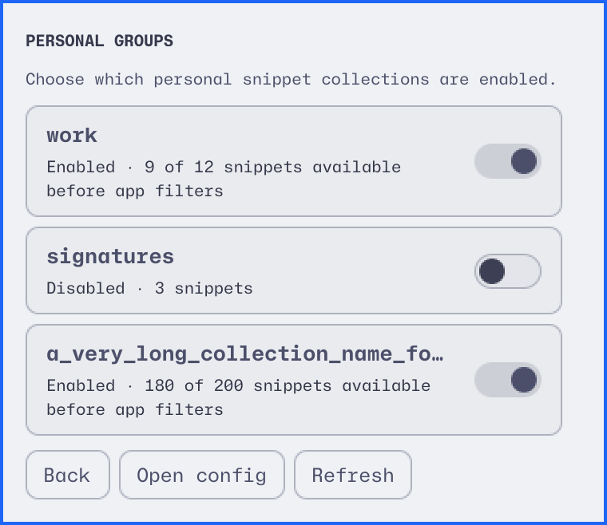
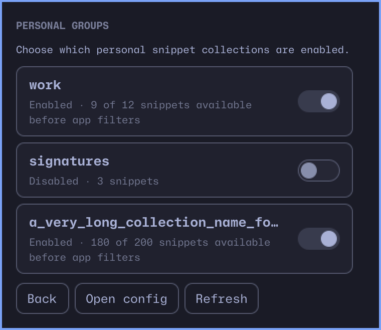

# Personal group controls

The Groups view extends the existing compact panel. SnipExpand owns definitions,
selection, and durable state; the plugin sends explicit enable/disable commands
and reads back authoritative group state. It never edits YAML or writes its own
preference copy. Definitions can be edited with Open config.

The native Toggle rows support Tab, Space, and Enter. Focus returns to the changed
row after the list refreshes. Back and Escape return to the snippet picker.
Loading and ongoing commands prevent duplicate actions. Failed commands show the
CLI error and refresh current state, without replaying a possibly completed
mutation. SnipExpand versions before 0.5.0 receive an upgrade explanation.
Global Pause still takes precedence; group changes remain saved while paused.

Counts are match definitions available before application filters. Overlapping
groups and unavailable nested dependencies may lower them. A zero count is valid.
Disabled snippets are hidden in the picker; older daemon inventory without the
availability field retains its previous behavior.

## Verification

- JS parser/filter tests fail the process on assertions.
- A real offscreen Quickshell controller test crosses Process stdout, exit,
  error, and refresh handlers using a disposable CLI fixture.
- Manifest and locked QML dependencies validate.
- Native group views rendered in contrasting themes, with long names and wrapped
  counts. Lint candidates were reviewed: JS model arrays and clipped ListViews
  are intentional; dynamic source text uses PlainText.

